# Dripp AI backend
P2P Social Network focussed on fashion.

# Flows

## Identity / cloudless DID based

1. Group Creation Flow (from identity perspective)
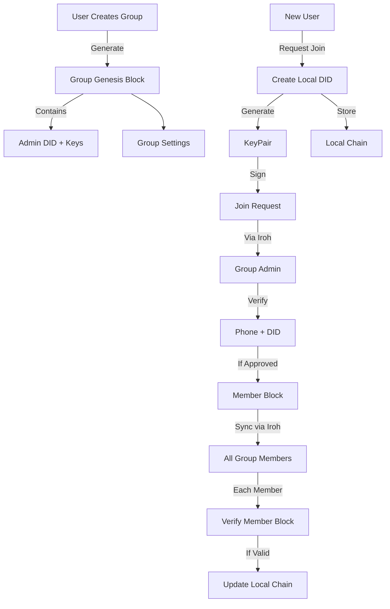

2. Request to join groups flow (DID)
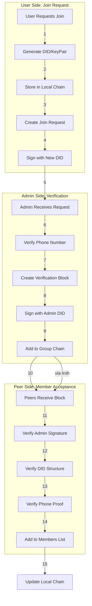
3. Post creation and verification flow
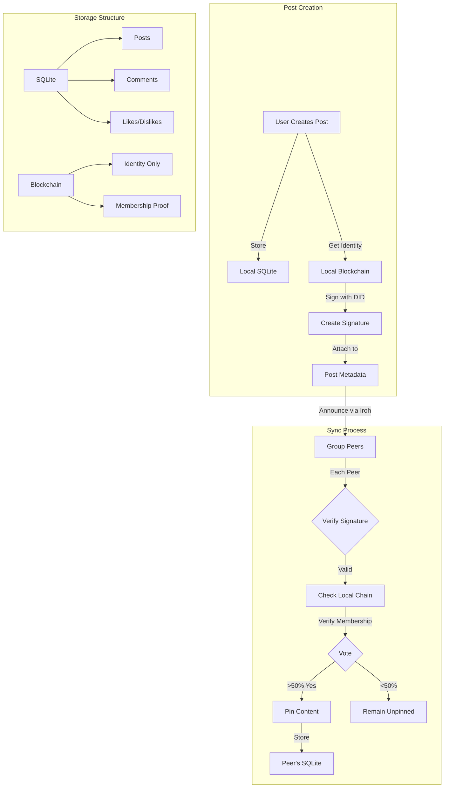
4. Interactions (Like/Comment) Flow: (DID perspective)
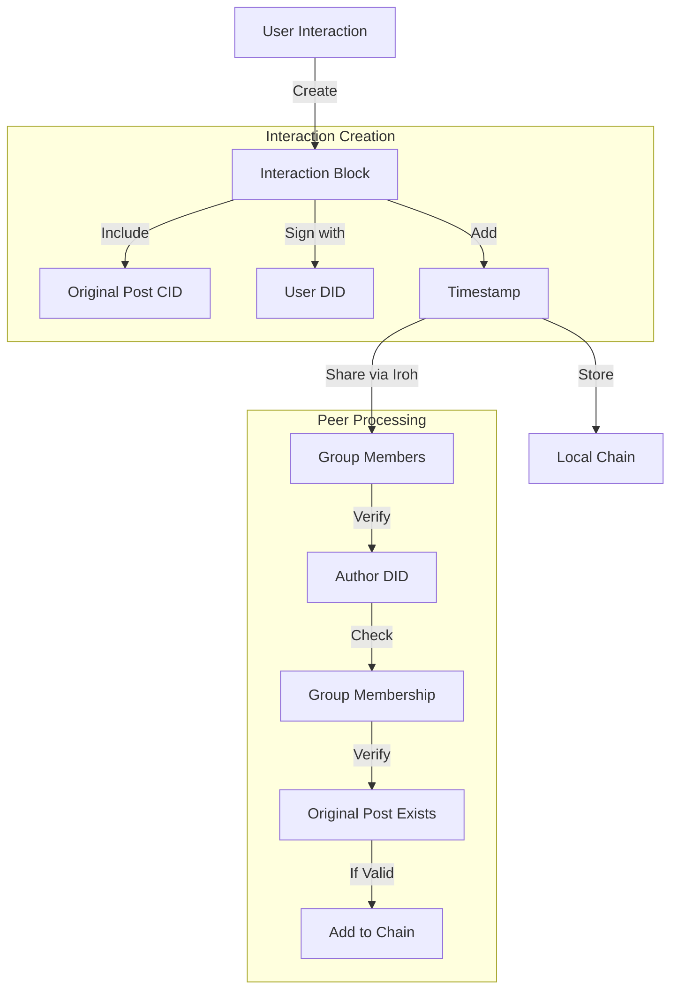

## Non-Identity flows (actual data)
### Group creation flow:

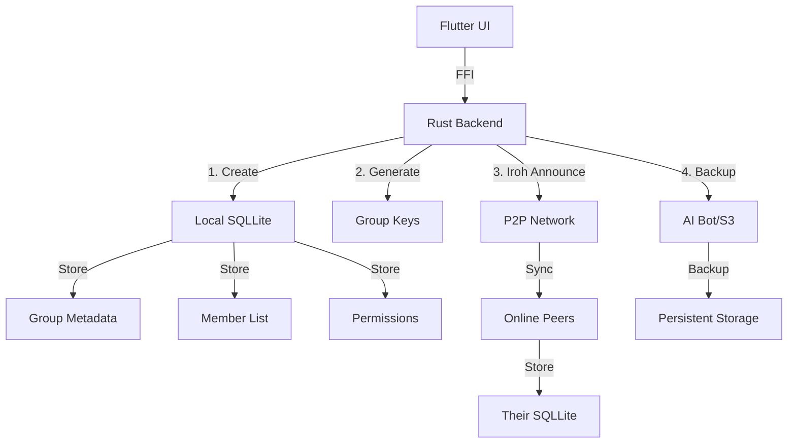

2A. Only OP online (everyone in group offline)

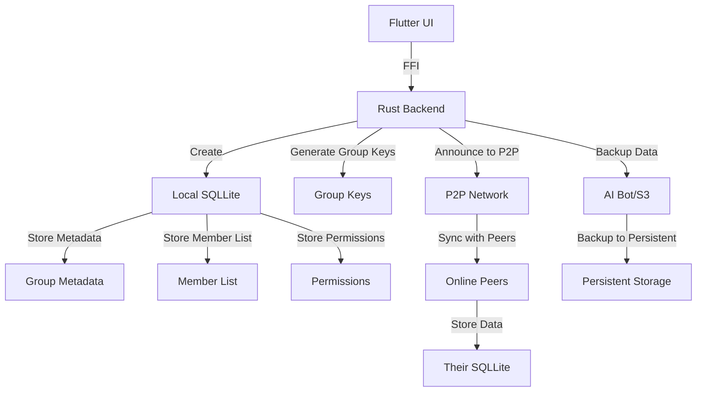

2B All online

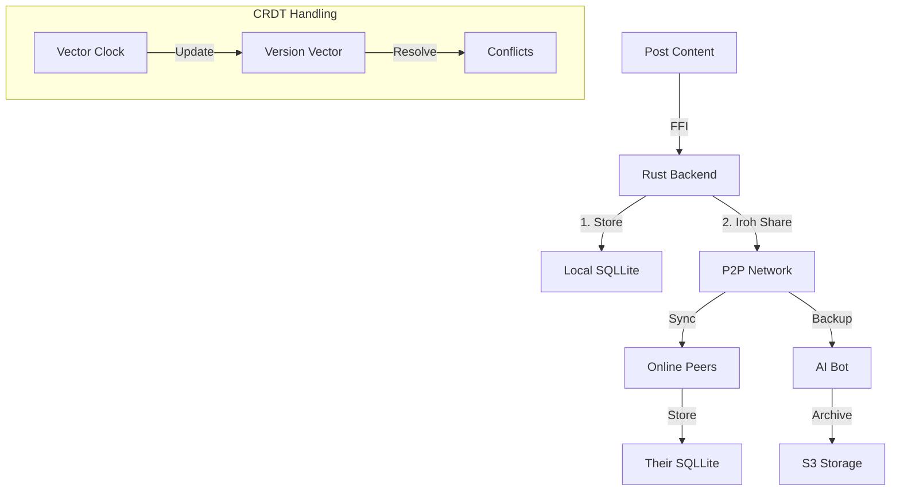
2C Posting Partial Online

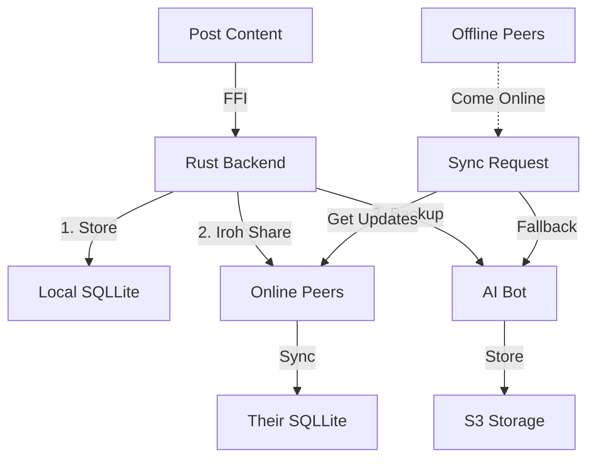

3 Interactions: Comments, likes, dislikes

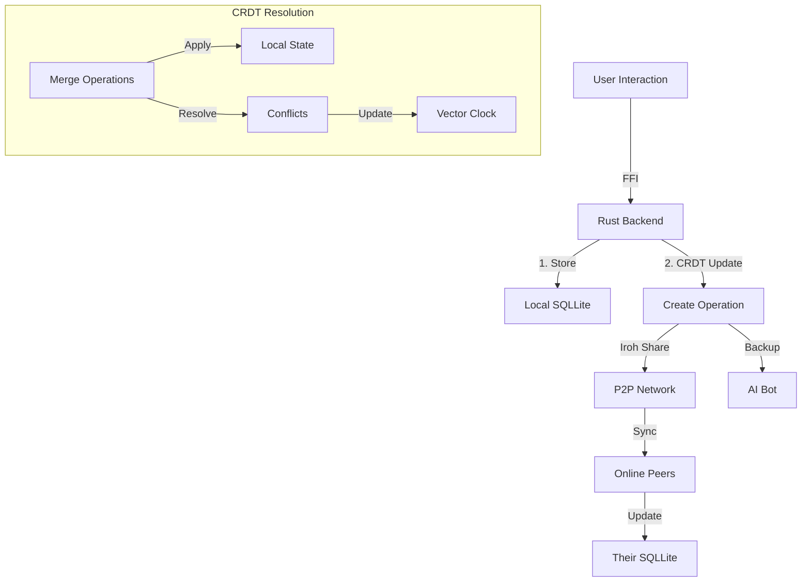

## Key Considerations for Implementation:

### CRDT Management:
- Use operation-based CRDTs for interactions
- Vector clocks for causality tracking
- Conflict resolution strategies

## FFI Layer:

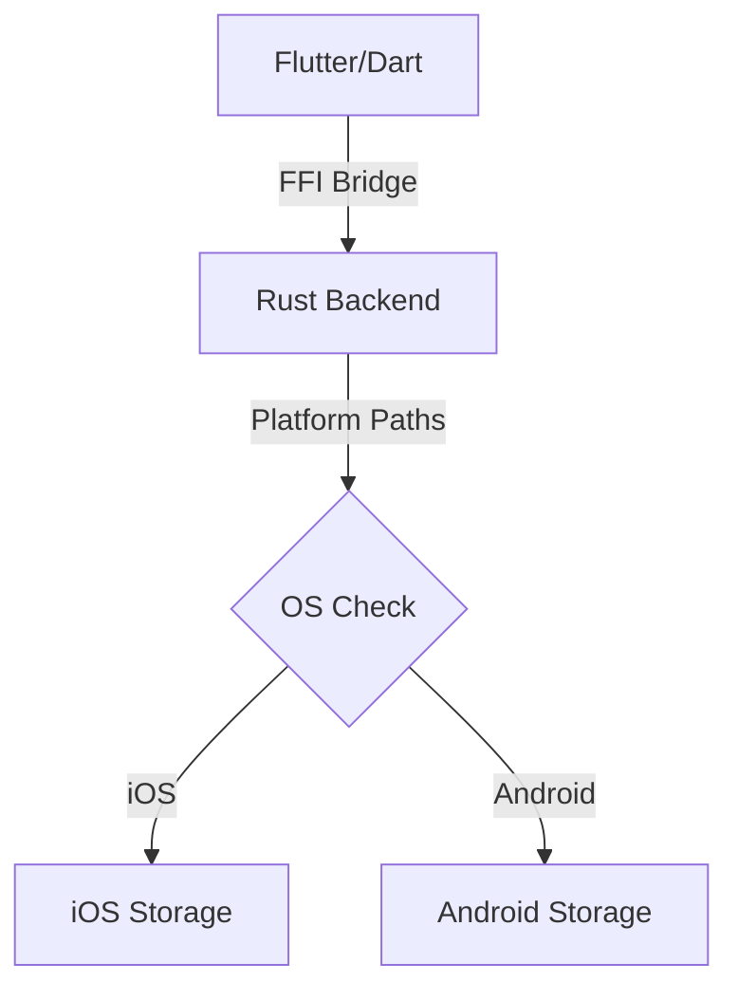
## Storage Strategy forks
- SQLLite per group
- Platform-specific paths
- Efficient indexing

## Peer to Peer direct sync

## Backup node AI Bot flow

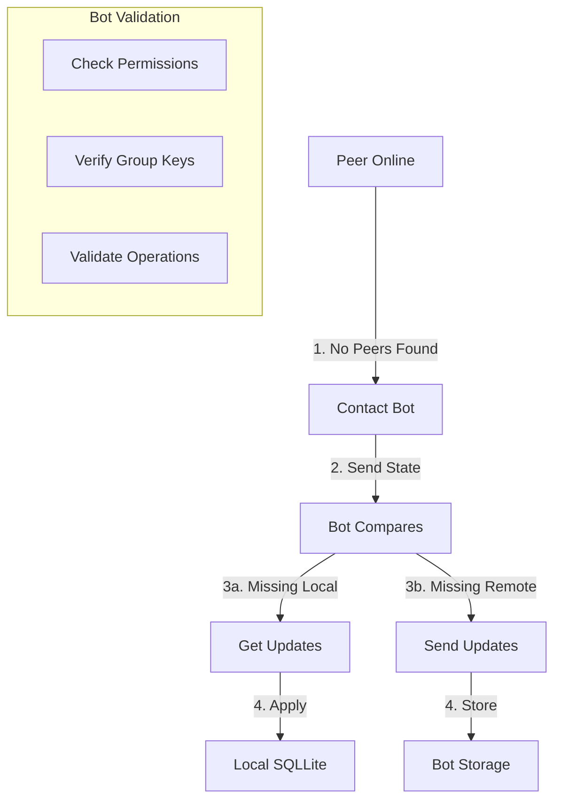
## Mixed node sync

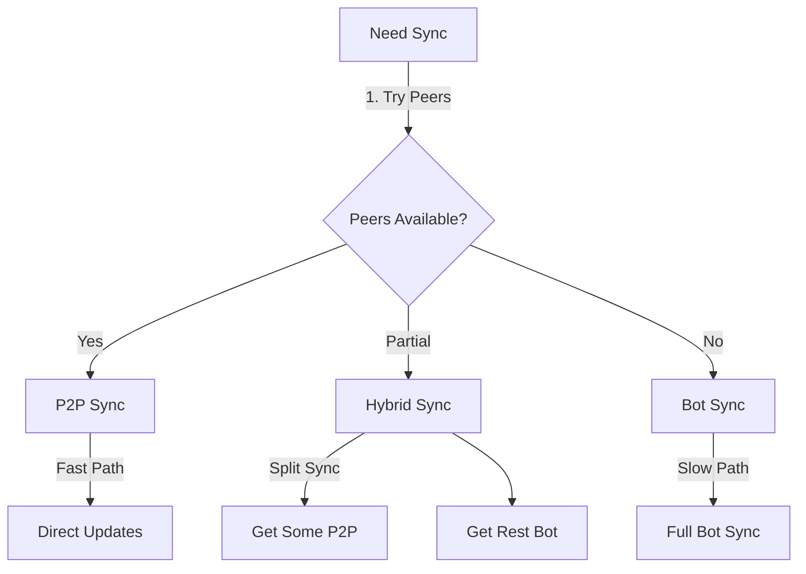

## key sync strategies
1. Priority order for sync

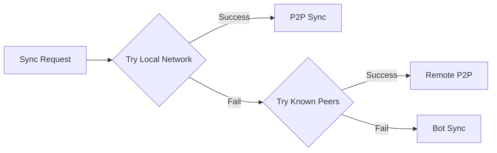
## CRDT Update flow

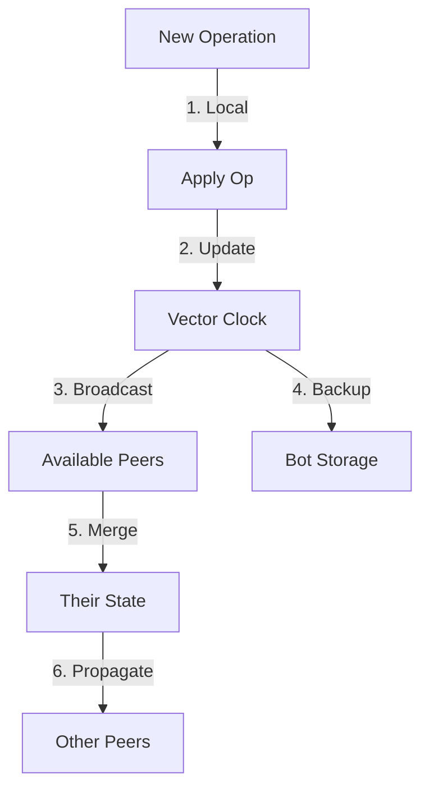
## Recovery Scenarios

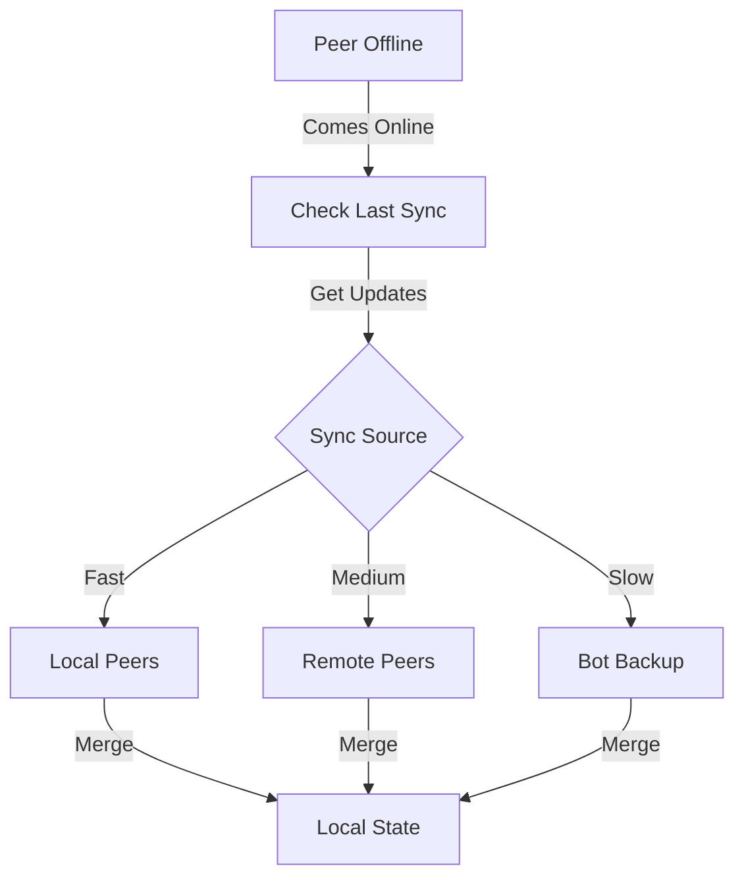

## Confict Resolution

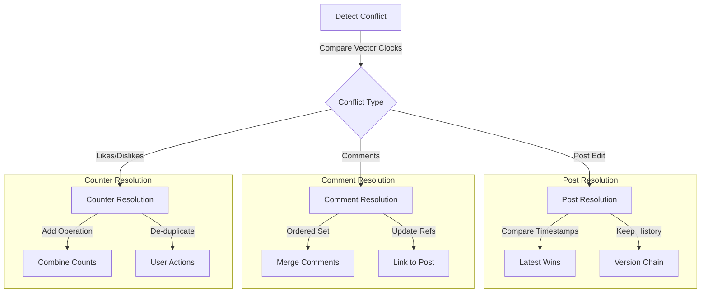
